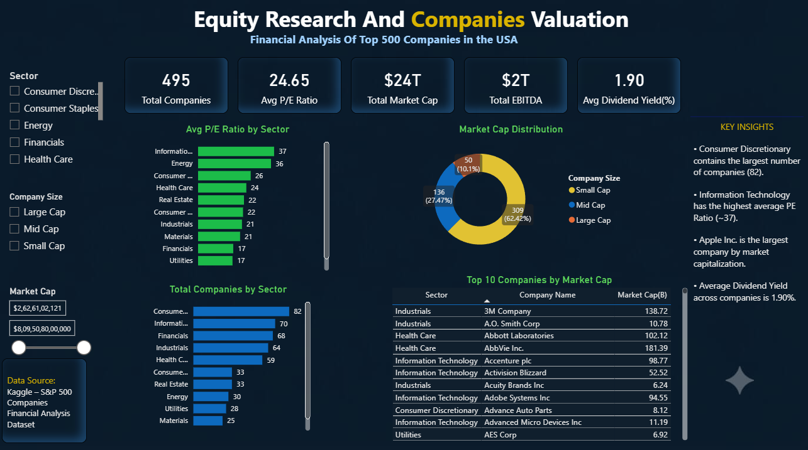

📊 Equity Research & Company Valuation Analysis

Overview

This project analyzes financial and valuation metrics of S&P 500 companies to identify sector performance, market leaders, valuation trends, and investment insights.

The project follows an end-to-end analytics workflow using Python (Pandas), MySQL, and Power BI.

Business Problem

Investors and financial analysts need to understand:

Which sectors dominate the market?

Which sectors have the highest valuations?

Which companies lead in market capitalization?

How are companies distributed across company sizes?

This project converts raw financial data into actionable business insights.

Dataset
Source: S&P 500 Financial Dataset

Original Records: 505

Final Records After Cleaning: 495

Features: Symbol, Sector, Price, P/E Ratio, Dividend Yield, EPS, Market Cap, EBITDA, Price/Book

Tools Used

Python (Pandas)

Matplotlib

Seaborn

MySQL

Power BI

GitHub

Project Workflow

Data Cleaning (Pandas)
        ↓
        
Exploratory Data Analysis
        
        ↓
SQL Business Queries
        
        ↓
Power BI Dashboard
        
        ↓
Business Insights

Key Analysis Performed

Python (Pandas)

Missing value treatment

Descriptive statistics

Sector-wise analysis

Correlation analysis

SQL

Aggregate functions

Subqueries

CTEs

Window Functions

Ranking analysis

Power BI

KPI Cards

Sector Analysis

Market Cap Distribution

Interactive Filters

Executive Dashboard

Key Insights

Consumer Discretionary has the highest number of companies (82).

Information Technology has the highest average P/E Ratio (~37).

Information Technology dominates total market capitalization.

Apple Inc. is the largest company by market capitalization.

Market Cap shows a strong positive relationship with EBITDA.

Dashboard Preview

Business Recommendations

Monitor the Technology sector due to its high valuation and market dominance.

Analyze companies trading above sector-average P/E ratios for growth opportunities.

Large-cap companies offer stronger financial stability and market presence.

Diversification across sectors can help reduce investment risk.

👤 Author

Payal Devi

Aspiring Data Analyst | Finance Analytics Enthusiast

SQL • Python • Power BI • Excel • Data Visualization
